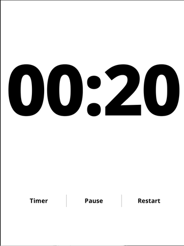
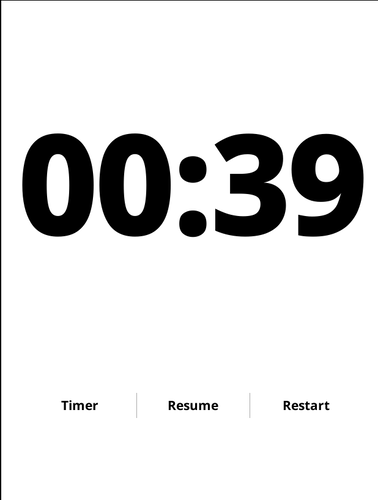

# Stopwatch & Timer for KOReader

A [koreader][1] plugin to display a stopwatch or a timer in a fullscreen widget.
A clean, fullscreen, perfectly centered stopwatch with Pause / Resume and Restart buttons.
And a timer which you can set in 5 minute increments from 5 up to 30 minutes with a Restart button.

## Motivation

I sometimes need a stopwatch or a timer, so why not use my ereader?

Should work on every KOReader device (Kobo, PocketBook, Android, Linux…).

## Installation

1. Go to the [releases page](https://github.com/markleenders/stopwatchtimer.koplugin/releases).
2. Download the `stopwatchtimer.koplugin.zip` file from the latest release.
3. Extract and copy the `stopwatchtimer.koplugin` folder into the `plugins` directory of your KOReader installation.
4. Restart KOReader to load the plugin.

## Usage

Navigate to `Plugins -> More tools -> StopWatch / Timer` to open the widget. Tap
anywhere on the screen (outside of the buttons) to close the widget. Use the buttons to pause/resume or restart.
Or use the toggle button to switch between the stopwatch and the timer. In Timer mode there's a button to add 5 minutes to 
the timer.

## Testing

Tested with Koreader 2025.10 on a Kobo Clara 2E and linux.

[1]: https://github.com/koreader/koreader

## Screenshots

Stopwatch Running:

Stopwatch Paused:

Timer Running:

